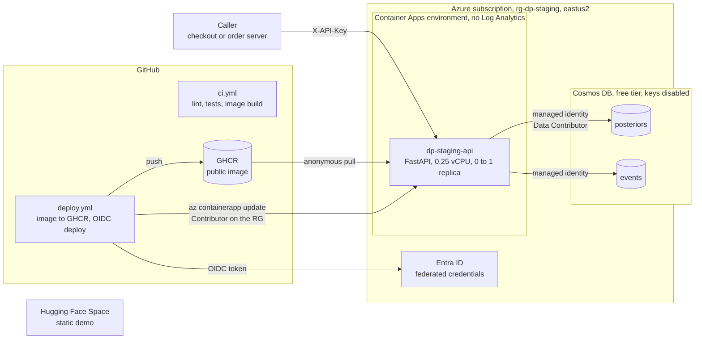
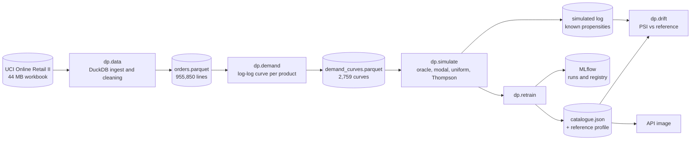
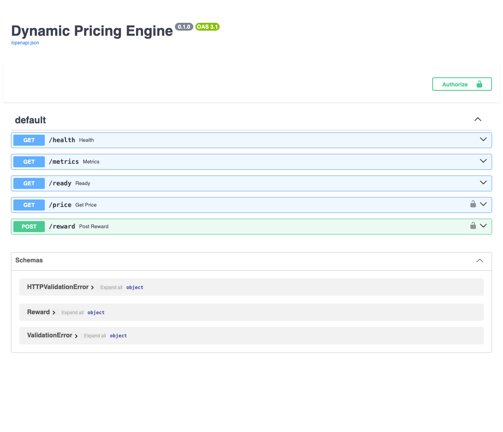
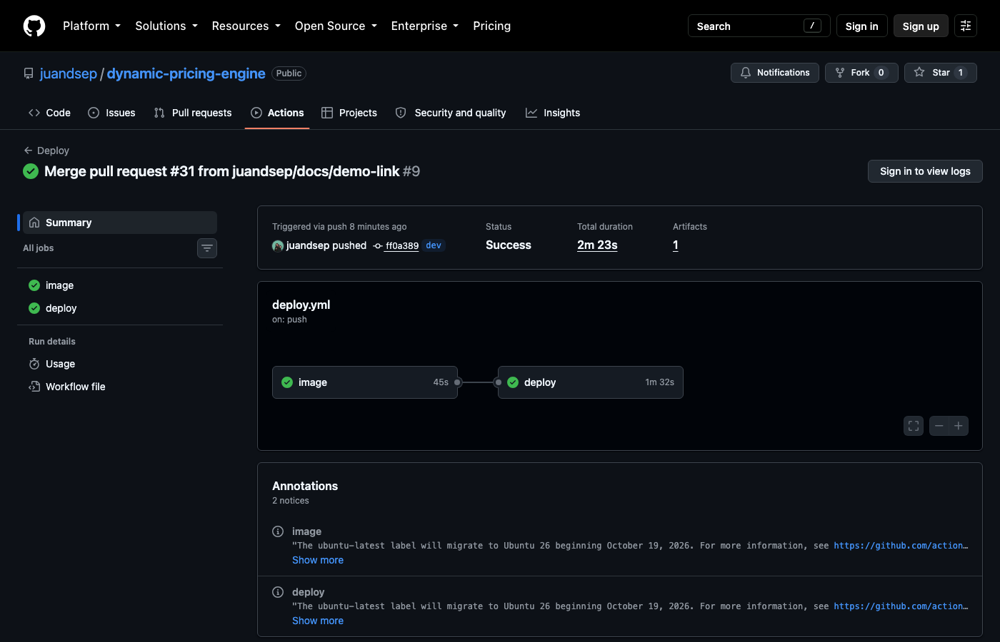
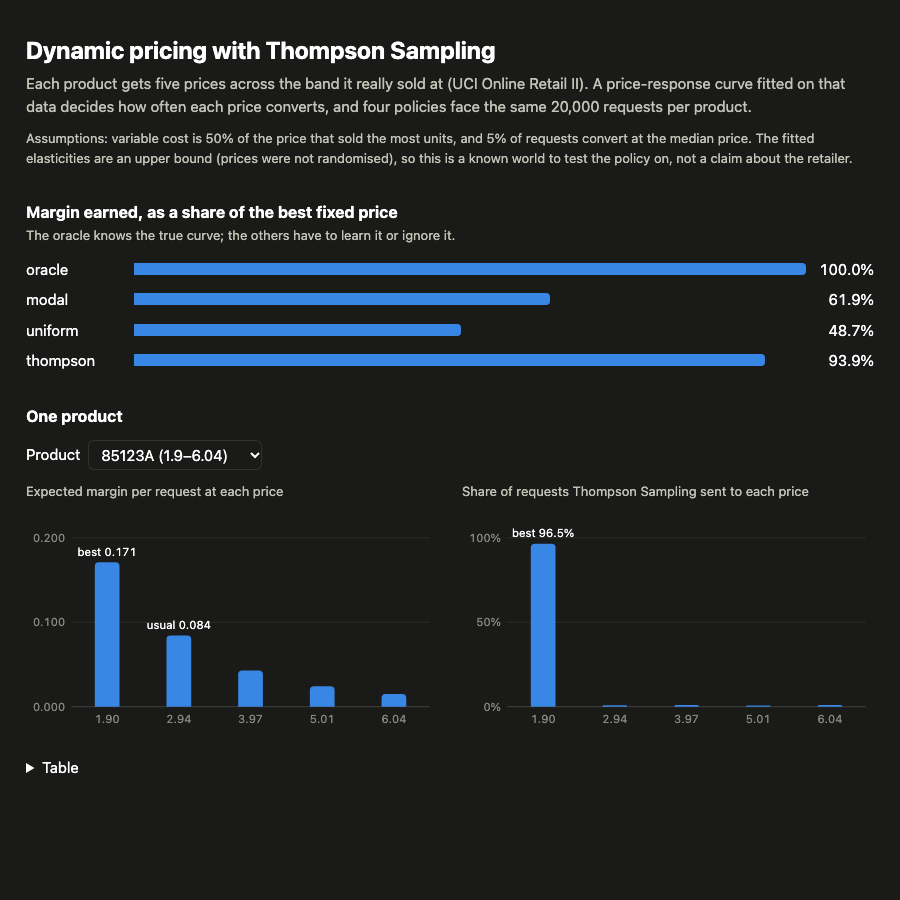

# dynamic-pricing-engine

A single price for every customer leaves money on the table: buyers with a high
willingness to pay are charged less than they would accept, price-sensitive buyers
leave, and the price that maximises margin moves with stock, season and competition.
A static price cannot follow it.

This repository assigns a price per request, treating each price level as an arm of a
multi-armed bandit and solving it with Thompson Sampling: sample the Beta posterior of
every price arm of the product, weight it by the arm's margin, serve the highest, observe
the outcome, update.
It is a portfolio project to practice the full MLOps loop on a zero budget — data
ingestion, demand modelling, offline policy evaluation, experiment tracking, a model
registry, a serving API, CI/CD and infrastructure as code on Azure.

- **Data:** UCI Online Retail II, about 1M order lines with the price actually charged
  and the quantity bought, fitted into a price–response model that acts as the
  simulator's ground truth.
- **Model:** Thompson Sampling, one Beta posterior per (product, price arm), against the
  best fixed price, the price the retailer usually charged and a uniform policy, compared by
  regret and share of the oracle's margin.
- **Stack:** DuckDB, MLflow, FastAPI, Azure Container Apps, Cosmos DB, Terraform,
  GitHub Actions.
- **Status:** every phase is merged and released; the Azure stack was applied, verified end
  to end and destroyed on 2026-10-05 ([evidence](#verified-on-azure)); it comes back with one
  `terraform apply` ([PLAN.md](PLAN.md) has the phase-by-phase record).

[](https://github.com/juandsep/dynamic-pricing-engine/actions/workflows/ci.yml)

**Demo:** [huggingface.co/spaces/sepulvedajd/dynamic-pricing-demo](https://huggingface.co/spaces/sepulvedajd/dynamic-pricing-demo) — the policy comparison and, per product, what each price earns against where Thompson Sampling sent the traffic. Static, no backend.

## Results

Top 50 products by units sold, five price arms each across the band the product really
sold at, 20,000 requests per product; every policy faces the same requests and the same
conversion draws (`uv run python -m dp.simulate`):

| Policy | Expected margin | Regret vs oracle | Share of oracle |
|---|---|---|---|
| Oracle (best fixed price per product, knows the curve) | 53,125 | 0 | 100% |
| **Thompson Sampling** | 49,981 | 3,144 | **94.1%** |
| Modal price (what the retailer usually charged) | 48,450 | 4,675 | 91.2% |
| Uniform random | 33,395 | 19,730 | 62.9% |

The retailer's usual price is already the best of the five in 41 of 50 products: within the
band it really priced in, it priced well. Thompson Sampling does not know that and pays for
exploring first; it overtakes the usual price after about 10,500 requests per product and
ends 3.2% above it, at 94.1% of the oracle. Its posterior settles on the oracle's arm in 45
of 50 products (median 770 requests); the other five have their two best arms within 2.2%
of each other.

**Regret** is what the best fixed price in hindsight would have earned minus what the
policy earned — the pricing equivalent of a Qini curve. Read these numbers as a policy
finding the optimum of a known world, not as money the retailer lost: the world is built
from fitted elasticities that are an upper bound (prices were not randomised), with cost
at half the modal price and 5% conversion at the median price, because the data has
neither costs nor conversions. The uniform log the simulator writes, with known
propensities, replays through the same `--events` path, where SNIPS recovers each arm's
true margin.

## Architecture



More diagrams, all tied to the code: the request sequence, the training pipeline, the module
dependencies read from the graphify code graph, and the delivery flow are in
[docs/diagrams.md](docs/diagrams.md).

| Component | What it does | Runs on |
|---|---|---|
| Ingestion and demand | Raw order lines to Parquet, a price–response curve per product | DuckDB, local or GitHub Actions |
| `dp.simulate` | Simulator on the fitted curves (oracle, modal, uniform, Thompson), uniform log with known propensities, replay with SNIPS | anywhere, numpy |
| Thompson policy | Beta posterior per (product, arm), with a price guard | the API process |
| Cosmos DB | One posterior document per product, impressions and rewards | Azure, 1000 RU/s shared by both containers on the free tier, keys disabled |
| MLflow | Experiment tracking and the policy registry | DagsHub, free hosted |
| dp-api | FastAPI, `GET /price`, `POST /reward`, `/metrics` | Container Apps, 0 to 1 replica |
| GHCR | The API image (383 MB: serving dependencies only, the pipeline stays out), public package pulled anonymously | GitHub |
| GitHub Actions | CI on every pull request; image to GHCR and OIDC deploy on `dev`; retrain on demand | GitHub |
| Terraform | Everything above the subscription-scope bootstrap | local, applied and destroyed around a demo |

Nothing bills while idle: every resource is free-tier, inside a per-subscription free
grant, or destroyed after use, and the budget is fixed at 10 USD/month as a tripwire.
The prices behind each rejected alternative — Redis, ACR, a self-hosted MLflow backend —
are in [infra/README.md](infra/README.md).

## Training pipeline



1. **ingest** (`dp.data`) — DuckDB reads both sheets of the workbook and writes Parquet,
   keeping the price actually charged on every order line and dropping returns,
   cancellations and non-product codes.
2. **demand** (`dp.demand`) — fits a log-log price–response curve per product, scored on
   the months after a time cut. This is the part that needs real data: without price
   variation in the log there is nothing to estimate.
3. **simulate** (`dp.simulate`) — turns each curve into a product with a known conversion
   probability per arm, plays the oracle, the modal price, uniform and Thompson Sampling on
   the same requests, and writes a uniform log with known propensities.
4. **track and register** (`dp.retrain`) — one MLflow run per execution and one child per
   policy; the best deployable policy is registered as a new immutable version, with the
   catalogue it serves and the reference profile drift is measured against.
5. **drift** (`dp.drift`) — PSI of an impression log against that reference profile, on the
   product mix and on where in each product's band the served price sits.
6. **experiment** (`dp.experiment`) — reads a randomised price test: the causal elasticity
   per product and how many requests the test needs for a target precision.
7. **rebuild** (`dp.rebuild`) — recounts every posterior from the event log, so rewards that
   arrived after their window, or whose live update failed, still reach the policy. A dry run
   unless `--write`.

## Serving

`GET /price?user_id=...&product=...` returns one of the product's price arms, drawn by
Thompson Sampling from the product's posterior, and logs the impression with its propensity
and an `impression_id`, so a later `POST /reward` can attribute the outcome. A product
outside the catalogue is a 404. The served price is always inside `PRICE_MIN` /
`PRICE_MAX`, and each response carries the policy version that produced it.

Both endpoints need the `X-API-Key` header: the callers are servers (checkout, order
system), and an open `/reward` would let anyone steer prices. Each replica caps itself at
`RATE_LIMIT_RPS` (429 with `Retry-After`), bodies over `MAX_BODY_BYTES` are refused with 413
before parsing, and `/metrics` exposes latency per route, prices served per policy version,
rewards by outcome and `dp_price_guard_clamped_total`: how often an arm fell outside
`PRICE_MIN`/`PRICE_MAX`, so the guard is measured instead of assumed.

`POST /reward` is idempotent by request id: a retried reward cannot move the posterior
twice, and a reward for an arm that was never served is rejected. When the store cannot be
written the endpoint answers **503** instead of a silent 200, because a lost outcome
degrades learning while a false success corrupts it.

The serving path never reads the model registry — the catalogue ships in the image and the
posterior lives in the store — so the API needs no tracking credential. The request path, the failure behaviour and the
ceiling behind the single-replica design are in [docs/architecture.md](docs/architecture.md).

## Model tracking and retraining

Every pipeline run logs one parent MLflow run (parameters, the curves and the simulated log
attached) and one child run per policy with its regret, margin and share of the oracle.
Only the best deployable policy is registered, and the SHA-256 of the feature table and of
the curves are logged so a policy can be traced to the exact data it saw. Tracking is a
local SQLite file by default and DagsHub's free MLflow server in CI (`retrain.yml`, manual
trigger). The runs and the registry are public:
[dagshub.com/juandsep/dynamic-pricing-engine](https://dagshub.com/juandsep/dynamic-pricing-engine/experiments)
(first CI retrain on 2026-10-08: Thompson 94.1%, modal 91.2%, uniform 62.9% of the oracle,
`dynamic-pricing-policy` version 1).

UCI Online Retail II does not change, so retraining it reproduces the same numbers. With
live traffic, retrain when a new randomised price test closes, when the margin measured on
that test drops, or when the traffic mix drifts — a segment that changes mid-log
invalidates the history behind the posterior.

## Verified on Azure

The stack was applied to a real subscription on 2026-10-05, exercised, measured and destroyed
the same day. What that run proved, beyond the 49 offline tests:

| Check | Result |
|---|---|
| Deploy by OIDC | `deploy.yml` logged in with a federated credential (no stored key), rolled the app onto the commit's image and passed its smoke test on `/ready` |
| Managed identity to Cosmos | a reward applied to the posterior through the app's identity, with account keys disabled |
| Idempotent rewards | the same reward id answered as a duplicate; the posterior moved once |
| Guards | 401 without the key, 404 for an unknown product or impression, 413 over 4 KB, 429 with `Retry-After: 1` on 5 of 40 concurrent requests |
| Latency | `/price` p95 under 25 ms server side (238 of 240 requests in the 25 ms bucket); the first request after scaling from zero took about 3 s |
| Cost | 0 USD: Cosmos free tier, Container Apps inside the monthly grant, scaled to zero, destroyed after the run |

The evidence is in [docs/evidence](docs/evidence): the verbatim
[live session](docs/evidence/live-session.md), the
[Azure inventory](docs/evidence/azure-inventory.md) as the CLI reported it before the destroy,
and screenshots.

| API contract (Swagger, from the live app) | Deploy run (image, then OIDC deploy) |
|---|---|
|  |  |



## Price experiment on Azure

The historical prices were chosen by the retailer, so the elasticities fitted on them are
biased, and only a randomised price test can measure the real ones. On 2026-10-07 the API ran
on Azure in experiment mode (`EXPERIMENT_SHARE=1`: each customer gets one of a product's five
prices at random, with propensity 1/5, the same price on every reload) and 20,556 simulated
shoppers bought from it following a **hidden** curve, less price-sensitive than the
observational one. The events were exported from Cosmos DB and analysed with `dp.experiment`.

| | Result |
|---|---|
| Hidden elasticity recovered | 9 of 10 products within two standard errors (median SE 0.13 at about 2,000 requests per product) |
| Observational elasticity | rejected for all 10: 5.4 to 14.1 standard errors from the measured value |
| Example, 85123A | observational -3.86, hidden -2.32, measured -2.75 ± 0.18 |

The customers are synthetic; the assignment, the logging, Cosmos DB, the export and the
analysis are the production path. Per-product table and how to rerun it:
[docs/evidence/price-experiment.md](docs/evidence/price-experiment.md).

## Data

The exercise runs on **UCI Online Retail II**: 1,067,371 order lines from a UK online
retailer between December 2009 and December 2011, across 5,305 products and 53,628 invoices,
with `Invoice`, `StockCode`, `Description`, `Quantity`, `InvoiceDate`, `Price`, `Customer ID`
and `Country`. It is free, needs no account and downloads over plain HTTP,
which matters because CI fetches it too.

What makes it usable for pricing: the same product is sold at several different prices
over time, so the price–response curve is identifiable, and quantity gives an outcome to
maximise. Measured on the download: after dropping returns, zero prices and cancellations,
**88.6% of products have at least two price points and 77.6% have three or more** (median 4),
and 99.2% of the rows sit behind those products. Fitting them (`python -m dp.demand`) keeps
2,759 products, with a median elasticity of −2.41 and a median R² of 0.53 — 0.26 when a curve
fitted before May 2011 is measured on the months after it. What it does **not** have is propensities — nobody logged the probability of the
price that was charged — so it cannot be used for off-policy evaluation directly. That is
why the pipeline fits demand on the real data and then simulates a log with known
propensities on top of it.

The event log the service writes is a separate contract, specified in
[docs/data-contract.md](docs/data-contract.md) with the attribution rules and the volume a
policy needs before its posteriors mean anything.

## Run locally

Requires [uv](https://docs.astral.sh/uv/).

```bash
uv sync
uv run pre-commit install
uv run pytest -q

scripts/fetch_data.sh                  # 44 MB into data/raw/ (git-ignored)
uv run python -m dp.data               # clean both sheets → data/processed/orders.parquet
uv run python -m dp.demand             # price-response curves → data/processed/
uv run python -m dp.retrain            # simulate, track in MLflow, register the best policy

uv run uvicorn dp.api:app --reload     # http://localhost:8000

export API_KEY=local-dev                 # set it before starting uvicorn too
curl -H "X-API-Key: $API_KEY" "http://localhost:8000/price?user_id=user-42&product=84077"
curl -X POST http://localhost:8000/reward -H "X-API-Key: $API_KEY" -H "content-type: application/json" \
  -d '{"id": "r-1", "impression_id": "<from /price>", "converted": true, "margin": 0.3}'
```

Simulate the four policies on the fitted curves and write a uniform log, then replay it
(log format in `docs/data-contract.md`):

```bash
uv run python -m dp.simulate
uv run python -m dp.simulate --events data/processed/simulated_log.jsonl --baseline-price 2.95
```

## Reproduce on Azure

The one-off bootstrap — resource providers, the 10 USD budget, the GitHub Actions identity
with its federated credentials and the role assignment — is written out step by step in
[infra/README.md](infra/README.md). After that everything is Terraform, applied before a
demo and destroyed after.

## Configuration

| Variable | Default | Description |
|---|---|---|
| `COSMOS_ENDPOINT` | none | Cosmos DB account; unset runs on defaults with no credentials required |
| `COSMOS_DATABASE` | `pricing` | Database name |
| `MLFLOW_TRACKING_URI` | `sqlite:///mlflow.db` | Tracking and registry backend |
| `PRICE_MIN` / `PRICE_MAX` | `0.01` / `100` | Guard on every served price; the arms already sit inside each product's band |
| `CATALOGUE_PATH` | `src/dp/catalogue.json` (in the package) | Arms and unit cost per product, written by `python -m dp.retrain` |
| `API_KEY` | none | Required by `/price` and `/reward`; unset, both answer 503 (fail closed) |
| `RATE_LIMIT_RPS` | `20` | Requests per second per replica before 429; `0` disables it |
| `MAX_BODY_BYTES` | `4096` | Larger request bodies are refused with 413 before parsing |
| `POLICY_VERSION` | `v1-thompson` | Policy version reported by `/price` and `/ready`, never a floating alias |

No connection strings and no key vault: the service authenticates to Cosmos with its managed
identity, and CI authenticates to Azure with OIDC federated credentials. The one secret is
`API_KEY`, a Container Apps secret set from Terraform.

## Project layout

```
src/dp/
  api.py           FastAPI app: /price, /reward, /health, /ready
  thompson.py      Thompson Sampling policy
  catalogue.json   the served arms and unit cost per product (written by dp.retrain)
  retrain.py       pipeline run tracked in MLflow, best policy registered
  drift.py         PSI of live traffic against the registered reference profile
  rebuild.py       posteriors recounted from the event log
  experiment.py    causal elasticity and sample size from a randomised price test
  shoppers.py      synthetic customers with a hidden demand curve, for a live price test
  export.py        the Cosmos event log as JSONL
  store.py         posterior and event store
  simulate.py      policy simulator, logged-bandit generator, offline replay
scripts/           dataset download
docs/              architecture, data contract, diagrams, evidence from the Azure run
infra/             Terraform and the one-off bootstrap
monitoring/        what /metrics exposes and how drift is read
demo/              static page over the simulation (Hugging Face Space)
tests/             unit and integration tests
```

## What is left

Done means every phase in [PLAN.md](PLAN.md) is merged, released to `main` and verified on
Azure. What remains is either an owner's account step or a limit the design accepts on purpose:

- **Real customers.** The randomised price test ran end to end on Azure with simulated
  shoppers ([above](#price-experiment-on-azure)). What only a store can add is people: point
  a checkout at `/price` with a small `EXPERIMENT_SHARE` (say 10%), and `dp.experiment`
  reads the result.
- **Scale.** One replica, a per-replica rate limit and one API key. The `ponytail:` notes in
  the code name the trigger for each upgrade (Redis, per-key limits, a transactional batch).

To bring the stack back for a demo: `terraform apply` in `infra/` (about 7 minutes, Cosmos is
the slow part), then `gh variable set AZURE_CONTAINER_APP --body dp-staging-api` so pushes to
`dev` deploy again.

## Contributing

Changes go on a `feat/`, `fix/` or `chore/` branch cut from `dev` and merge into `dev`
through a pull request; `main` only receives pull requests from `dev`. Details and checks
are in [CONTRIBUTING.md](CONTRIBUTING.md).

---

**Stack:** Python 3.11 · uv · FastAPI · NumPy · DuckDB · pandas · MLflow · Prometheus client · Azure Cosmos DB · Azure Container Apps · Terraform · GHCR · GitHub Actions
