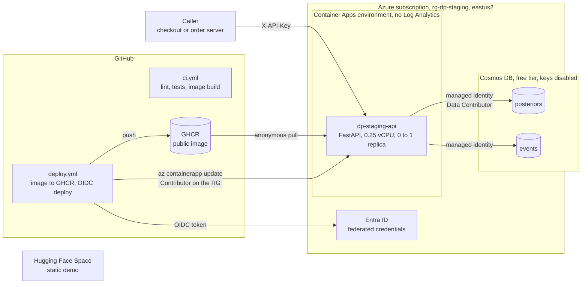
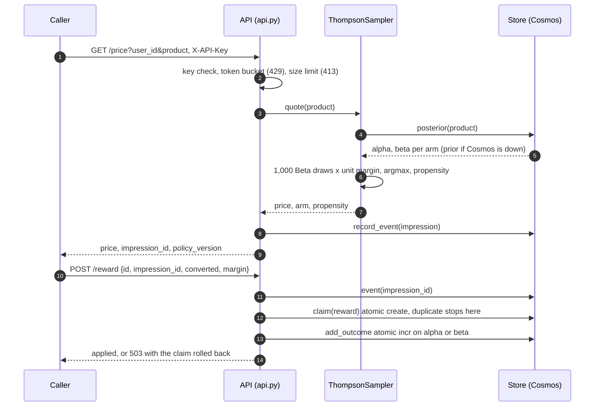
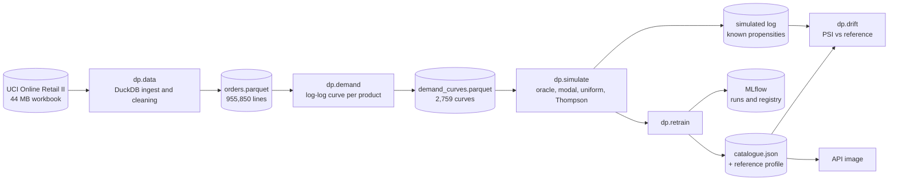
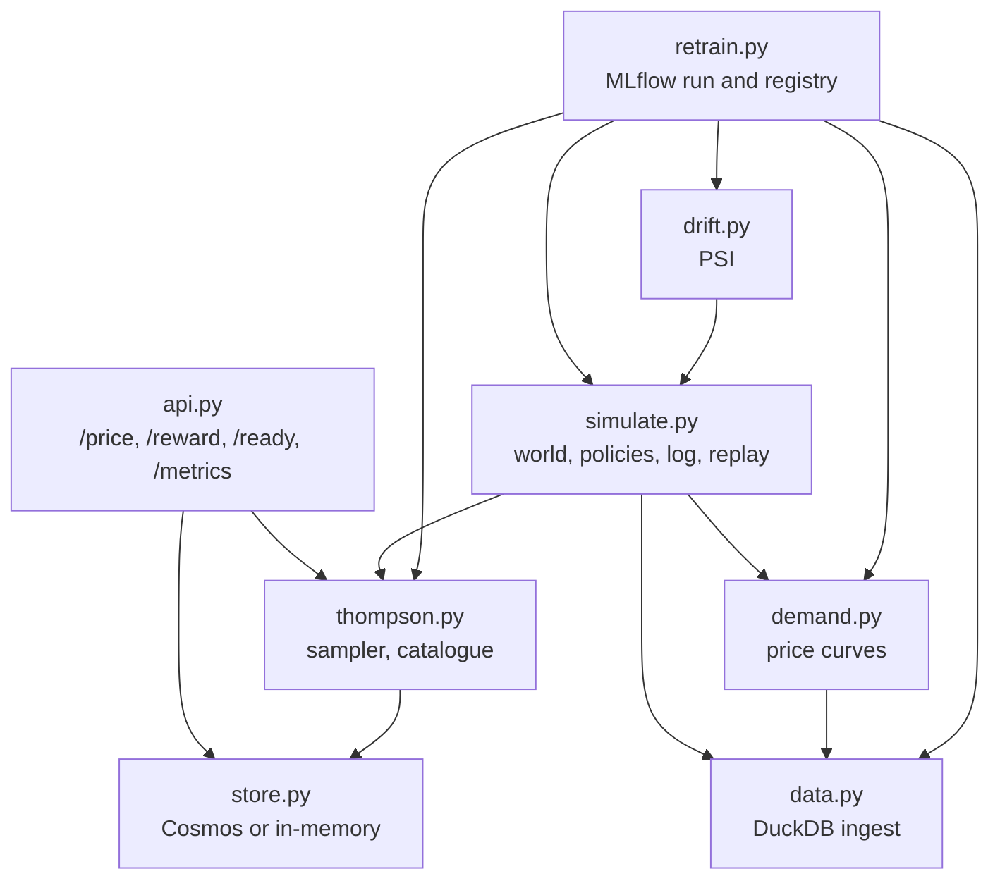
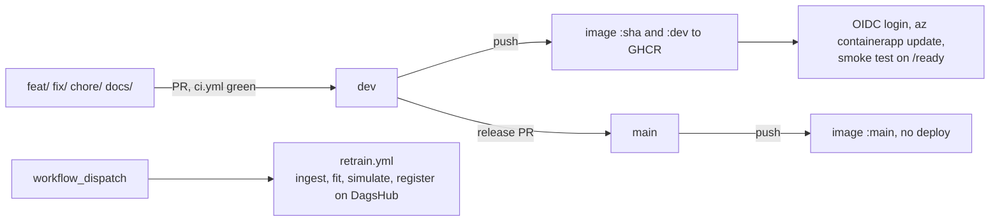

# Diagrams

Every box and arrow below maps to code or Terraform in this repository. The module diagram is
generated from the graphify code graph (`graphify update .` builds it into `graphify-out/`, which
is git-ignored): its import edges were read from the graph and checked against the source.

## Deployment on Azure

## Request path

## Training pipeline

## Module dependencies (from the code graph)

An arrow means "imports from". Read from the `imports_from` edges graphify extracted, which the
graph marks `EXTRACTED` (taken from the AST, not inferred).

The serving side (`api`, `thompson`, `store`) imports nothing from the pipeline side, which is
what lets the image leave out DuckDB, pandas and MLflow (383 MB instead of 1.42 GB).

What the graph says about the code as a whole (443 nodes, 850 edges, 21 communities, no import
cycles): the most connected abstractions are `Store` (22 edges), `load_events()` (17),
`get_sampler()` (15) and `retrain.run()` (15).

## Delivery

